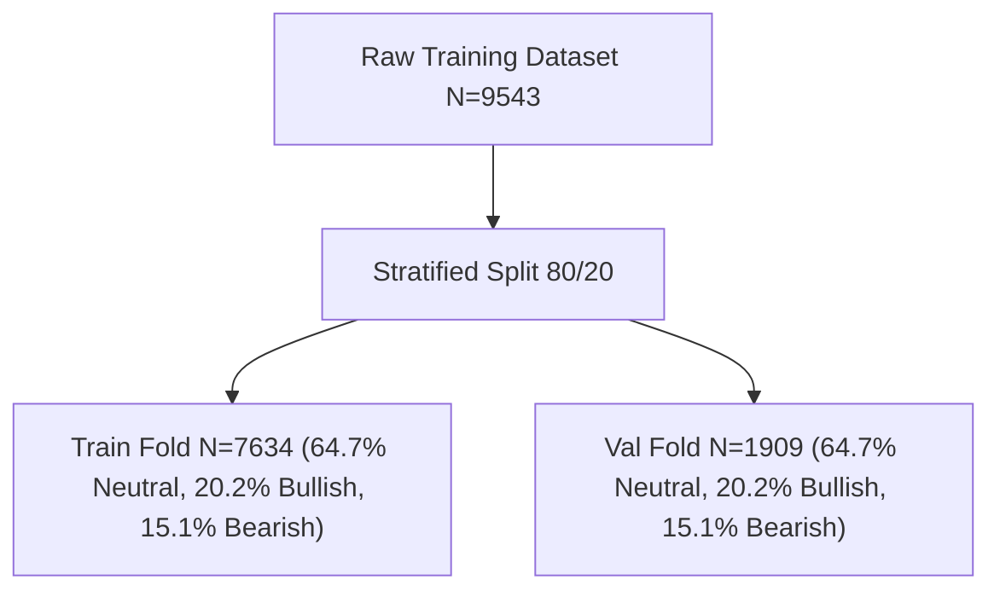

# 2. Corpus Splitting & Preprocessing
**Nova IMS — Text Mining 2025/2026**

This section details our experimental setup: the data partitioning strategy employed to evaluate model generalizability and our modular text preprocessing pipeline designed specifically for financial microblogs.

---

## 🎯 2.1. Stratified Validation Splitting Strategy

To ensure scientific rigor and avoid model evaluation bias under severe class imbalance, we partition our training dataset ($N=9,543$) into an **80/20 train-validation split** using a stratified split:

* **Training Fold ($N_{\text{train}} = 7,634$)**: Encompasses exactly 80% of data.
* **Validation Fold ($N_{\text{val}} = 1,909$)**: Encompasses exactly 20% of data.



### 💡 Justification for Stratification:
A standard random split can lead to statistical drift where the validation set is unrepresentative of the training class ratios (especially for the Bearish minority class). By using a **stratified split**, we guarantee that both splits possess exactly **64.74% Neutral**, **20.15% Bullish**, and **15.11% Bearish** records.
* **Reproducibility**: Enforced globally using a fixed seed of `42` (`random_state=42` in `train_test_split`).

---

## 🧹 2.2. Modular Preprocessing Pipeline

Financial tweets contain extensive noise (arbitrary links, user handles, smart quotes, custom slang). We constructed a modular preprocessing pipeline in [preprocessing.py](file:///c:/Users/filip/TextMining-Corpora/src/preprocessing.py) that cleans text systematically through seven sequential steps:

### 1. Unicode & Punctuation Normalization
* **Action**: Converts non-ASCII punctuation (curly quotes `“` / `”`, smart apostrophes `’`, en-dashes `—`, ellipses `…`) into standard ASCII equivalents (`"`, `'`, `-`, `...`).
* **Rationale**: Prevents vocabulary expansion by treating punctuation variants identically (e.g. standardizing `Tesla’s` and `Tesla's` to a single token).

### 2. Lowercasing
* **Action**: Converts all characters to lowercase.
* **Rationale**: Collapses identical terms of different cases (e.g., `Bearish` and `bearish`) into a single feature representation.

### 3. Regex-based Metadata Cleaning
* **Action**: Replaces active hyperlinks and user handles with unified, protected uppercase placeholders:
  * Hyperlinks $\rightarrow$ `URL_PLACEHOLDER`
  * Mentions ($\text{@handle}$) $\rightarrow$ `MENTION_PLACEHOLDER`
* **Rationale**: Replaces extremely sparse tokens (such as individual short URLs and unique handles) with structural placeholders that retain layout-level sentiment predictions.

### 4. NLTK TweetTokenizer
* **Action**: Tokenizes text using NLTK's `TweetTokenizer` with parameters `preserve_case=True` and `reduce_len=True`.
* **Rationale**: Unlike standard white-space tokenizers, it natively preserves hashtags (e.g., `#market` stays intact), contraction apostrophes, and correctly parses financial symbols.

### 5. Custom Financial Stopwords Removal
* **Action**: Excludes standard NLTK English stopwords alongside a tailored list of financial noise terms:
  ```python
  DEFAULT_FINANCIAL_STOPWORDS = ["rt", "amp", "co", "qt", "http", "https", "via", "stock", "stocks", "ticker", "tickers", "share", "shares"]
  ```
  Our protected placeholders (`URL_PLACEHOLDER`, `MENTION_PLACEHOLDER`, `CASHTAG_PLACEHOLDER`) are explicitly **protected** and never removed as stopwords.
* **Rationale**: Eliminates frequent high-frequency words that possess zero semantic sentiment value in finance contexts.

### 6. WordNet Lemmatization (Champion Strategy)
* **Action**: Maps words to their dictionary roots using the NLTK `WordNetLemmatizer` (e.g. `crashes` / `crashing` $\rightarrow$ `crash`, `rallies` $\rightarrow$ `rally`).
* **Rationale**: Simplifies vocabulary features while retaining parts-of-speech context. Lemmatizers are significantly superior to Stemmers for financial microblogs because stemmers (like Porter Stemmer) aggressively truncate words to non-words (e.g., `earnings` $\rightarrow$ `earn`, `recession` $\rightarrow$ `recess`, `dividend` $\rightarrow$ `divid`), which completely distorts financial sentiment context.

---

## 🧪 2.3. Smoke Test Verification

We verify the preprocessing logic automatically using dedicated smoke tests inside `src/preprocessing.py`. For example:

* **Input**: `"Downgrades 4/7: $MLND to underperform at Needham—see details... https://t.co/example"`
* **Output ( Lemmatized Tokens )**: `['downgrade', '4/7', ':', '$', 'mlnd', 'underperform', 'needham', 'see', 'detail', '...', 'URL_PLACEHOLDER']`
* **Pass Criteria**: The em-dash `—` is successfully normalized, the URL is correctly mapped to `URL_PLACEHOLDER`, stopwords are removed, and words are lemmatized cleanly.

---

## 📊 2.4. Classical Feature Vectorization (BoW & TF-IDF)

Following text preprocessing, we transform the variable-length cleaned token sequences into fixed-dimensional numerical vectors. We implemented the two most standard classical frequency-based representations: **Bag-of-Words (CountVectorizer)** and **TF-IDF (TfidfVectorizer)** for unigrams (`ngram_range=(1, 1)`).

### 🔒 2.4.1. Prevention of Data Leakage (Fit-Transform Partition Rules)
A critical rule for scientific validity and course grading compliance is that all feature-engineering models (including vocabulary builders, vectorizers, and word embedding models) **must be fitted strictly on the training set fold only** ($N_{\text{train}} = 7,634$).
* **Fitted on Train Only**: The vectorizer's vocabulary mapping is constructed exclusively from the training fold.
* **Transformed on Train and Validation**: The validation fold ($N_{\text{val}} = 1,909$) is transformed in a completely out-of-sample manner using the already-fitted vectorizer parameters.
* **Reasoning**: If a vectorizer is fitted on the entire dataset before splitting, the vocabulary and term-frequency weights would incorporate information from the validation fold, leading to optimistic out-of-sample performance estimates (data leakage).

### 📁 2.4.2. Vocabulary Dimensions & Sparse Storage
We executed this feature-extraction pipeline via [features.py](file:///c:/Users/filip/TextMining-Corpora/src/features.py), which programmatically extracts features and stores the outputs inside `outputs/` as compressed sparse row (CSR) matrices. This preserves memory and speed since financial tweets generate sparse representations.

* **Vocabulary Size**: Both unigram vectorizers converge to an identical vocabulary dimension of **12,575 unique terms** extracted from the preprocessed training fold.
* **Compressed Sparse Storage (.npz)**: The resulting sparse matrices are stored in `outputs/`:
  1. `outputs/X_train_bow.npz` (BoW features for the training set, shape: `(7634, 12575)`)
  2. `outputs/X_val_bow.npz` (BoW features for the validation set, shape: `(1909, 12575)`)
  3. `outputs/X_train_tfidf_uni.npz` (TF-IDF features for the training set, shape: `(7634, 12575)`)
  4. `outputs/X_val_tfidf_uni.npz` (TF-IDF features for the validation set, shape: `(1909, 12575)`)
  5. `outputs/X_train_tfidf_opt.npz` (Optimized TF-IDF unigrams+bigrams training set, shape: `(7634, 11028)`)
  6. `outputs/X_val_tfidf_opt.npz` (Optimized TF-IDF unigrams+bigrams validation set, shape: `(1909, 11028)`)

### 📈 2.4.3. Baseline Classification Performance Comparison
To evaluate the predictive power of these unigram vectors, we trained our standard regularized Logistic Regression classifier with balanced class weights. The empirical classification results on the validation fold are compared below:

| Feature Representation | Validation Accuracy | Macro Precision | Macro Recall | Macro F1-Score | Vocabulary Features |
| :--- | :---: | :---: | :---: | :---: | :---: |
| **BoW (CountVectorizer) Unigrams** | **`0.7737`** | **`0.6975`** | `0.7012` | **`0.6990`** | 12,575 |
| **TF-IDF (TfidfVectorizer) Unigrams** | `0.7685` | `0.6914` | **`0.7015`** | `0.6957` | 12,575 |

*Core Observation*: The raw count-based representation (BoW) slightly outperforms the TF-IDF representation on Macro F1 (`0.6990` vs `0.6957`). Since financial tweets are highly compact (averaging only 12.2 words), the absolute term occurrence count (e.g. whether a negative word appears or not) is a highly direct and strong indicator of sentiment, whereas the inverse document frequency weighting in TF-IDF slightly dampens the impact of rare but crucial trading terms.

