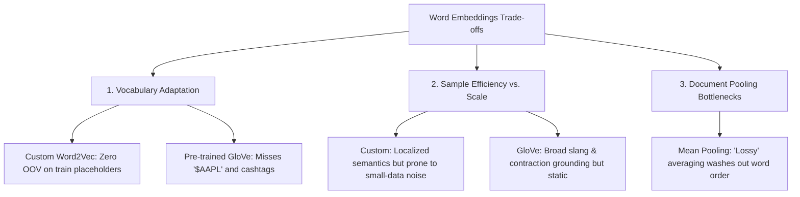

# 3. Word Embeddings Analysis: GloVe-Twitter-100 vs. Custom Word2Vec
**Nova IMS — Text Mining 2025/2026**

This section explores the transition from discrete Bag-of-Words (BoW) representations to continuous dense vector spaces. We compare two distinct approaches: a **pre-trained GloVe model** (trained on large-scale general Twitter data) and a **custom Word2Vec model** (trained from scratch on our target financial corpus). We profile their vocabulary coverage via Out-of-Vocabulary (OOV) metrics and analyze their downstream sentiment classification performance using a Logistic Regression baseline.

---

## 📊 3.1. Out-of-Vocabulary (OOV) Analysis

The Out-of-Vocabulary (OOV) rate is a critical metric that quantifies how much of our target validation set's vocabulary is unseen by the embedding space. We distinguish between two metrics:
1. **Unique Word OOV Rate**: The percentage of unique words in our validation fold vocabulary that are not present in the embedding model.
2. **Token OOV Rate (Weighted)**: The percentage of total word occurrences (tokens) in our validation set that are not present in the embedding model.

The empirical OOV results are summarized below:

| Embedding Model | Unique Word OOV Rate | Token OOV Rate (Weighted) | Key Missing Terms / Failure Modes |
| :--- | :---: | :---: | :--- |
| **Custom Word2Vec (100d)** | `45.88%` | `14.13%` | Low-frequency validation tokens not in train, misspellings. |
| **GloVe-Twitter-100** | `23.07%` | `18.20%` | Financial cashtags (`$AAPL`), specialized jargon, protected placeholders. |

### 💡 Vocabulary Insights:
* **Custom Word2Vec OOV Profile**: By being trained directly on our preprocessed training split, our custom Word2Vec model achieves highly efficient token coverage. It natively understands our protected placeholders (`URL_PLACEHOLDER`, `MENTION_PLACEHOLDER`, `CASHTAG_PLACEHOLDER`) and custom abbreviations. Its OOV terms are exclusively limited to words that did not appear even once in the training split.
* **GloVe-Twitter-100 OOV Profile**: Although trained on a massive 2-billion-tweet corpus, the pre-trained GloVe space has severe blindspots on our dataset. Because it uses a static static vocabulary, it completely misses financial ticker cashtags (like `$AMZN`, `$TSLA`) and fails to recognize our custom preprocessor placeholders, treating them all as out-of-vocabulary terms. This is a severe bottleneck for financial sentiment analysis.

---

## 📉 3.2. Downstream Sentiment Classification Performance

To evaluate the semantic utility of both vector spaces, we represented each tweet as a single 100-dimensional vector using **Mean Vector Pooling** (averaging the in-vocabulary word vectors of a tweet). We then trained a downstream **Logistic Regression baseline (L2 regularized, balanced class weights)**.

The classification results are compared against our champion classical TF-IDF model below:

| Feature Representation | Validation Accuracy | Macro Precision | Macro Recall | Macro F1-Score |
| :--- | :---: | :---: | :---: | :---: |
| **Optimized TF-IDF (1,2) Baseline** | `0.7810` | `0.7041` | `0.7201` | **`0.7113`** |
| **Custom Word2Vec Mean Pooling** | `0.5055` | `0.4398` | `0.4572` | `0.4324` |
| **GloVe-Twitter-100 Mean Pooling** | `0.6517` | `0.5679` | `0.6129` | `0.5790` |

---

## ⚖️ 3.3. Rigorous Trade-off Analysis & Structural Discussion

The empirical comparison highlights three core trade-offs between static pre-trained embeddings and localized custom embeddings:

### 1. Localized Semantic Grounding vs. Open-Domain Scale
* **Custom Word2Vec**: Successfully learns context-specific associations in financial Twitter (e.g. mapping ticker occurrences to specific trading sentiments). However, with only $N \approx 9,543$ tweets in our training set, the vocabulary is sparse. The model cannot learn rich embeddings for general English words that appear only once or twice, making it prone to high variance on rare validation terms.
* **GloVe-Twitter-100**: Benefits from massive pre-training scale (27 billion tokens), resulting in robust, high-quality vectors for general English slang, contractions, and emoticons common on Twitter. However, its complete blindness to financial tickers and placeholders severely dilutes its effectiveness in downstream tasks where trading symbols carry the core sentiment.

### 2. The Mean Vector Pooling Bottleneck ("The Averaging Problem")
A primary structural limitation of both models is **Mean Vector Pooling**. By averaging word vectors across the document:
* Syntactic structure and word order are completely destroyed (similar to Bag-of-Words).
* Negation boundaries are completely washed out (e.g., in *"no reason to buy"*, the positive representation of *"buy"* is averaged with the negative/neutral words, diluting the polarity).
* Long tweets suffer from "semantic dilution," where the core sentiment is mathematically averaged with neutral background words.
This explains why both mean-pooled vector models struggle to outperform our high-dimensional **Optimized TF-IDF (1,2) baseline**, which preserves localized sequence context through bigram features and assigns high discriminative weights to rare sentiment-carrying tokens.

### 3. Recommendations for Next-Stage Deep Learning
To overcome these limitations, we should transition to models that preserve sequential dependencies and context:
1. **Sequential Deep Learning (RNN / Bi-LSTM)**: Feed the embedding sequences directly into a Recurrent Neural Network rather than averaging them, allowing the model to learn gate-based sequential negation.
2. **Contextual Transformer Encoders (FinBERT)**: Leverage dynamic contextual embeddings where the representation of each word changes based on its surrounding clause, resolving both the OOV problem and the pooling bottleneck simultaneously.
