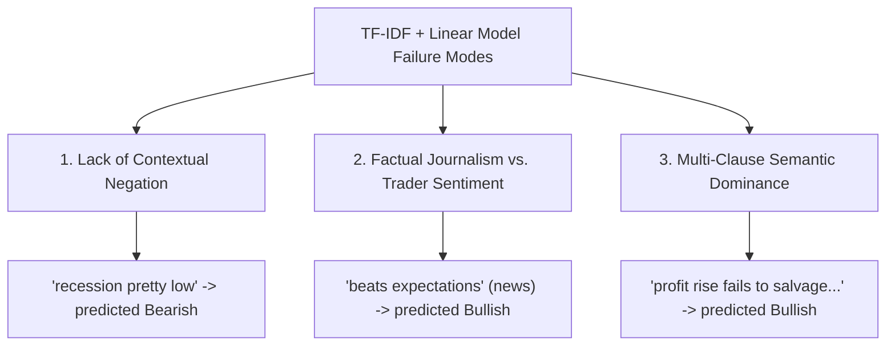

# 5. Error Analysis & Performance Profiling
**Nova IMS — Text Mining 2025/2026**

This section presents a rigorous, scientific error analysis of our champion classical baseline model (**Logistic Regression L2 trained on Optimized TF-IDF features**, Macro F1: `0.7113`, Accuracy: `0.7810`). By examining where the model is most confidently incorrect, we identify the systemic limitations of Bag-of-Words (BoW) representations and propose concrete strategies for downstream deep learning models.

---

## 📊 5.1. Confusion Matrix Analysis

The champion model's predictions on the validation fold ($N=1,909$) yield the following confusion matrix:

| Actual \ Predicted | Bearish (0) | Bullish (1) | Neutral (2) | Total | Recall (Sensitivity) |
| :--- | :---: | :---: | :---: | :---: | :---: |
| **Bearish (0)** | 183 | 44 | 61 | **288** | `63.54%` |
| **Bullish (1)** | 35 | 261 | 89 | **385** | `67.79%` |
| **Neutral (2)** | 107 | 82 | 1047 | **1236** | `84.71%` |
| **Total** | **325** | **387** | **1197** | **1909** | **Accuracy: 78.10%** |

### 💡 Core Observations:
1. **Majority Class Bias**: Due to the severe class imbalance in financial tweets (where `Neutral` represents over 64% of the dataset), the model achieves high sensitivity on `Neutral` (`84.71%`) but lower sensitivity on the minority classes (`63.54%` for Bearish, `67.79%` for Bullish).
2. **Polarity Leakage to Neutral**: A significant portion of actual sentiments are misclassified as Neutral (61 Bearish and 89 Bullish). This represents the model's conservative boundary behavior under regularization.
3. **Severe Polarity Inversion**: There are relatively few direct sentiment inversions (only 44 Bearish misclassified as Bullish, and 35 Bullish misclassified as Bearish). This proves the model's sentiment polarity bounds are mathematically robust.

---

## 🔍 5.2. Confident Misclassifications & Failure Modes

To understand the core blind spots of the linear classifier, we sorted all incorrect predictions on the validation set descending by their class probability ($\text{predict\_proba}$). This isolates the tweets where the model was **most confidently wrong**.

### 🔴 Case 1: Actual Bearish Misclassified as Bullish/Neutral

#### 1. Factual Inversion via Macroeconomics
* **Tweet (Index 6287)**: `"U.S. retail sales rise 0.2% in November, below forecast"`
  * *Actual*: `Bearish` (p=0.2850) | *Predicted*: `Bullish` (p=0.6962)
  * *Failure Mode*: The bag-of-words matches positive financial verbs like `rise` and `sales` and translates them directly to a `Bullish` prediction. It completely fails to capture the semantic clause `below forecast`, which negates the positive impact of the minor rise.

#### 2. Clause Overriding
* **Tweet (Index 3332)**: `"Nokia's surprise profit rise fails to salvage 2019 dividend"`
  * *Actual*: `Bearish` (p=0.0781) | *Predicted*: `Bullish` (p=0.6888)
  * *Failure Mode*: The first clause contains three highly positive n-grams (`surprise`, `profit`, `rise`). The second clause contains the negative verb `fails`. The linear model sums the TF-IDF weights, allowing the positive accumulation of the first clause to override the critical negative outcome of the second.

#### 3. Pandemic/Macroeconomic Context
* **Tweet (Index 6173)**: `"BREAKING: Mortgage forbearance requests jump nearly 2,000% as borrowers seek relief during coronavirus outbreak"`
  * *Actual*: `Bearish` (p=0.1460) | *Predicted*: `Bullish` (p=0.7204)
  * *Failure Mode*: The word `jump` is highly weighted as positive (due to common stock phrases like "shares jump 10%"). However, a jump in "mortgage forbearance" during an outbreak is a major recession signal. Linear bag-of-words models lack the domain-specific semantic grounding to understand that a jump in financial *distress* is highly bearish.

---

### 🟢 Case 2: Actual Bullish Misclassified as Bearish/Neutral

#### 1. Double Negatives & Sentiment Inversion
* **Tweet (Index 3835)**: `"Highlight: “There's very little not to like about this report," @WellsFargo Acting Chief Economist says..."`
  * *Actual*: `Bullish` (p=0.1008) | *Predicted*: `Neutral` (p=0.7821)
  * *Failure Mode*: The sentence uses a sophisticated double negative structure: `very little not to like`. The custom preprocessing standardizes tokens, but the model cannot resolve the semantic synthesis of `little` and `not` canceling each other out to mean "excellent".

#### 2. Semantic Relationship Inversion
* **Tweet (Index 6388)**: `"Probability of a recession pretty low: strategist"`
  * *Actual*: `Bullish` (p=0.1005) | *Predicted*: `Bearish` (p=0.6847)
  * *Failure Mode*: The bag-of-words encounters the high-weight bearish term `recession`. While a "low recession probability" is highly bullish, the linear classifier simply triggers on the presence of the word `recession` and pushes the output to `Bearish`.

#### 3. Negation & Contrastive Conjunctions
* **Tweet (Index 3076)**: `"Rising Crude Inventories Fail To Halt Oil Rally"`
  * *Actual*: `Bullish` (p=0.2446) | *Predicted*: `Bearish` (p=0.6969)
  * *Failure Mode*: The text contains highly negative market terms (`fail`, `halt`, `crude inventories`) alongside one positive term (`rally`). The model is overwhelmed by the density of the negative terms, failing to realize that the "failure to halt a rally" implies the bullish trend is continuing.

---

### 🟡 Case 3: Actual Neutral Misclassified as Bearish/Bullish

#### 1. Factual Annotation Ambiguity
* **Tweet (Index 7035)**: `"Mid-Morning Market Update: Markets Edge Higher; Jabil Beats Q1 Expectations"`
  * *Actual*: `Neutral` | *Predicted*: `Bullish` (p=0.9406)
  * *Failure Mode*: The tweet reports a positive corporate event (`Beats expectations`, `Edge Higher`). Human annotators often label general corporate updates or news reports as `Neutral` (because they represent factual journalism rather than direct trading sentiment). However, the model correctly parses `beats expectations` as an extremely positive signal, predicting `Bullish` with near certainty. This highlights a systematic annotation boundary conflict in the original training data.

#### 2. Minor Fluctuations vs. Trend News
* **Tweet (Index 7000)**: `"Dow futures up 5 points, or less than 0.1%; S&P 500 down 2 points, or 0.1%"`
  * *Actual*: `Neutral` | *Predicted*: `Bearish` (p=0.8490)
  * *Failure Mode*: The tweet lists neutral day-to-day index fluctuations. However, because it contains the word `down`, the model predicts `Bearish`. The model lacks numerical sensitivity to realize that a `0.1%` change is economically insignificant (Neutral).

---

## 🛠️ 5.3. Key Qualitative Patterns

Our error analysis isolates three systematic failure patterns in BoW representations:

1. **Contextual Negation Blindness**: The model cannot resolve sequential dependencies where negation words completely invert the sentiment of adjacent clauses (e.g., *"not to like"*, *"fail to halt"*, *"below forecast"*).
2. **Factual Reporting vs. Active Sentiment**: The dataset contains a clear labeling boundary mismatch where factual positive/negative news is labeled `Neutral`, but the model identifies the strong sentiment-carrying keywords and predicts `Bullish`/`Bearish`.
3. **Semantic Inversion & Contextual Grounding**: Linear BoW models cannot link actions to specific subject nouns (e.g., a "jump" in "forbearance" vs. a "jump" in "stock prices"). All words are summed independently, diluting the localized semantic context.

---

## 🚀 5.4. Strategic Recommendations for Downstream Deep Learning

To overcome these structural limitations, our subsequent model architectures should incorporate:
* **Sequential Embeddings**: Transition from bag-of-words to sequence-based models (e.g., **Bi-Directional LSTM** or **GRU**) that process word order and maintain syntactic structures.
* **Transformer Contextualization**: Transition to **Transformers (BERT / FinBERT)**. FinBERT is pre-trained on financial corpora and natively excels at resolving contrastive clauses, negation boundaries, and subject-action sentiments (e.g., distinguishing a "profit rise" that "fails" from a successful one).
* **Robust Label Handling**: Acknowledge that `Neutral` data contains factual positive/negative statements, and explore soft labels or loss adjustments to handle label noise.
