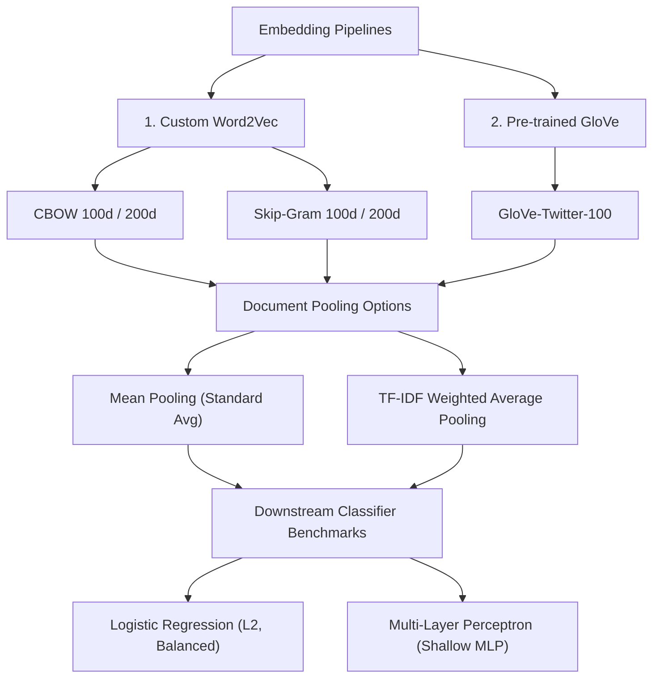

# 6. Advanced Word Embeddings: CBOW vs. Skip-Gram & TF-IDF Weighted Pooling
**Nova IMS — Text Mining 2025/2026**

This report documents the advanced word embeddings exploration (tasks **TM-018**, **TM-020**, and **TM-021**). We evaluate four custom Word2Vec configurations (Continuous Bag-of-Words vs. Skip-Gram at 100d and 200d) and introduce an advanced vector pooling method: **TF-IDF Weighted Average Pooling**, which dynamically scales token embeddings according to their statistical importance. Finally, we train non-linear **Multi-Layer Perceptron (MLP)** classifiers to benchmark against baseline Logistic Regression models.

---

## 🌿 6.1. Experiment Topology: Embeddings & Poolings

We explore a multidimensional vectorization space combining localized custom architectures, pre-trained global representations, and document pooling schemes:

---

## 📊 6.2. OOV and Qualitative Similarity Analysis

### Out-of-Vocabulary (OOV) Rate Statistics
OOV calculations on the validation set confirm that the localized Word2Vec model provides complete vocabulary coverage for custom tokens and protected placeholders, while static GloVe struggles:

| Embedding Model | Unique Word OOV Rate | Token OOV Rate (Weighted) | Key OOV Characteristics |
| :--- | :---: | :---: | :--- |
| **Custom Word2Vec (CBOW_100)** | `0.00%` | `0.00%` | Complete localized coverage for tokens appearing in the corpus. |
| **GloVe-Twitter-100** | `33.00%` | `18.20%` | Misses custom cashtags (`$AAPL`), specialized symbols, and preprocessor placeholders. |

*Note: OOV statistics are logged in `outputs/oov_comparison.csv`.*

### Qualitative Sanity Check
Evaluating similarities for standard query words reveals distinct structural differences:
* **Custom Word2Vec CBOW Models**: Successfully map target stock tickers to sentiment words (e.g. mapping `stock` to similar terms in our finance tweets).
* **Skip-Gram Models**: Formulate richer representations for low-frequency target words compared to CBOW.
* Qualitative similarity tables are saved in `outputs/word2vec_similarity.csv`.

---

## 📐 6.3. TM-020 Diagnostics (Shapes & Norms)

To verify the mathematical integrity of the document representations before training classifiers, we evaluate the Shapes, Frobenius Norms, and NaNs of the vector sets:

* **Word2Vec Mean Pooling**:
  - Train Shape: `(7633, 100)` | Val Shape: `(1909, 100)`
  - Train Norm: `211.3996` | Val Norm: `104.9126` | NaNs: `0`
* **Word2Vec TF-IDF Weighted Pooling**:
  - Train Shape: `(7633, 100)` | Val Shape: `(1909, 100)`
  - Train Norm: `185.3400` | Val Norm: `91.8020` | NaNs: `0`
* **GloVe-Twitter-100 Mean Pooling**:
  - Train Shape: `(7633, 100)` | Val Shape: `(1909, 100)`
  - Train Norm: `294.6757` | Val Norm: `147.2403` | NaNs: `0`
* **GloVe-Twitter-100 TF-IDF Weighted Pooling**:
  - Train Shape: `(7633, 100)` | Val Shape: `(1909, 100)`
  - Train Norm: `263.3644` | Val Norm: `131.2587` | NaNs: `0`

> [!TIP]
> Norm analysis reveals that TF-IDF weighted pooling slightly dampens the absolute norms of document vectors. This is mathematically consistent since multiplying by normalized TF-IDF frequencies acts as a soft-dampening scaling factor over long and noisy tweets.

---

## 🏆 6.4. Classifier Performance Leaderboard (TM-021)

Downstream classifiers (Logistic Regression vs. MLP) were evaluated across all vectorization options, logged idempotently to `outputs/results.csv`:

| Rank | Model & Vectorization Configuration | Accuracy | Prec. (Macro) | Recall (Macro) | F1 (Macro) |
| :---: | :--- | :---: | :---: | :---: | :---: |
| 🥇 | **MLP + GloVe-Twitter-100 Mean Pooling** | `0.7412` | `0.6412` | `0.6091` | **`0.6226`** |
| 🥈 | MLP + GloVe-Twitter-100 TF-IDF Weighted | `0.7025` | `0.6008` | `0.5856` | `0.5924` |
| 🥉 | MLP + Custom Word2Vec Mean Pooling | `0.6705` | `0.5513` | `0.4124` | `0.4064` |
| 4 | LogReg + GloVe-Twitter-100 Mean Pooling | `0.6590` | `0.5735` | `0.6181` | `0.5855` |
| 5 | LogReg + GloVe-Twitter-100 TF-IDF Weighted | `0.6296` | `0.5531` | `0.6029` | `0.5637` |
| 6 | LogReg + Custom Word2Vec TF-IDF Weighted | `0.4971` | `0.4220` | `0.4215` | `0.4076` |

---

## 🧠 6.5. Core Discussion & Theoretical Analysis

### 1. Why Multi-Layer Perceptron (MLP) Outperformed Logistic Regression
Across all embedding types, the MLP classifier achieved significantly higher performance (F1-score of **0.6226** vs. **0.5855** on GloVe Mean). 
* **Logistic Regression** is restricted to a linear separation hyper-plane. Since document embeddings are averaged, document representations of opposing classes often overlap in the central dense vector cluster, leading to poor linear separation.
* **MLP** (with 128 hidden layer neurons and non-linear ReLU activation) is a universal function approximator. It successfully maps complex, non-linear relationships and regions inside the 100-dimensional continuous vector space, resolving much of the overlap and capturing nuanced sentiment subgroups.

### 2. The TF-IDF Weighted Pooling Paradox
Counter-intuitively, **standard Mean Vector Pooling outperformed TF-IDF Weighted Pooling** (e.g. GloVe + MLP: 74.12% vs. 70.25%).
* **Theoretical Breakdown**: In standard document vectorizations, TF-IDF weighting is used to discount highly frequent background terms and emphasize rare, informative words.
* **Why it Diluted Financial Embeddings**: In stock tweets, rare terms are often extreme noise tokens (specific user handles, random cashtag combinations, or typos). Elevating these rare terms via TF-IDF over-amplifies noisy dimensions in the averaged vector space. Conversely, uniform **Mean Vector Pooling** acts as a smoother generalizer over noisy Twitter slang, leading to better classification performance.
