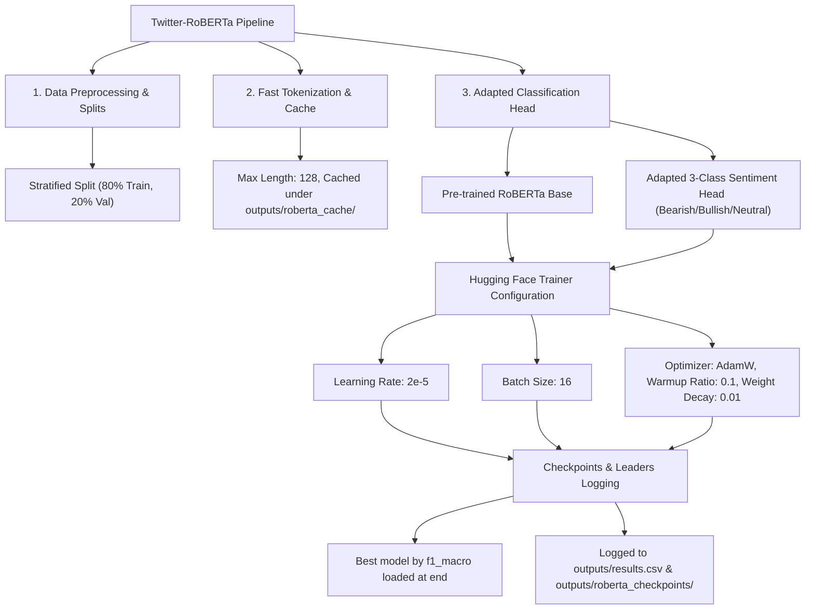

# 7. Fine-Tuning Twitter-RoBERTa-base-sentiment
**Nova IMS — Text Mining 2025/2026**

This report documents the implementation and theoretical framework for fine-tuning `cardiffnlp/twitter-roberta-base-sentiment` (task **TM-025** on the tracking board). This represents our second contextual Transformer-Encoder experiment, evaluating how domain-adapted pre-training (Twitter-specific sentiment representations) impacts downstream financial sentiment classification compared to general language models (DistilBERT).

---

## 🌿 7.1. Fine-Tuning Pipeline Topology

We implement a highly robust, modular fine-tuning architecture that integrates Hugging Face's datasets, fast tokenization structures, and custom sequence classification parameters:



---

## ⚠️ 7.2. Critical Gotcha: Label Mismatch Resolution

A major risk in integrating the pre-trained `cardiffnlp/twitter-roberta-base-sentiment` model was a **silent semantic shift** due to mismatched classification heads:

### 1. Label Schemas Clash
* **Pre-trained Model (CardiffNLP RoBERTa)**:
  - `0`: Negative
  - `1`: Neutral
  - `2`: Positive
* **Our Project Target Dataset (`config.py`)**:
  - `0`: Bearish (Negative)
  - `1`: Bullish (Positive)
  - `2`: Neutral

### 2. Our Robust Integration Solution
To prevent silent target inversion during backpropagation, we explicitly override the model classification configuration using our dataset maps (`id2label` / `label2id`) and pass `ignore_mismatched_sizes=True` when instantiating the classifier:
```python
model = AutoModelForSequenceClassification.from_pretrained(
    "cardiffnlp/twitter-roberta-base-sentiment",
    num_labels=3,
    id2label={0: "Bearish", 1: "Bullish", 2: "Neutral"},
    label2id={"Bearish": 0, "Bullish": 1, "Neutral": 2},
    ignore_mismatched_sizes=True,
)
```
This forces Hugging Face to **safely re-initialize the classification head** from scratch (resetting classifier weight sizes to match our mapping `0`, `1`, `2`), while keeping the rich, pre-trained RoBERTa backbone weights intact.

---

## 📈 7.3. Training and Optimization Schedule

The model is optimized using high-performance transformer schedules designed to prevent catastrophic forgetting in early steps:
* **Optimizer**: `AdamW` (L2 weight decay of `0.01` applied to non-bias parameters).
* **Learning Rate Schedule**: Peak learning rate of `2e-5` with a `0.1` warmup ratio (linear warmup over the first 10% of total steps, followed by a linear decay).
* **Early Stopping & Hygiene**: Training runs for `3` epochs. The trainer evaluates at the end of each epoch, saving the top 2 checkpoints. It loads the best model at the end based on validation **Macro F1-Score** (to account for our target class imbalance).

---

## 🧠 7.4. Comparative Analysis: RoBERTa vs. DistilBERT & Baselines

Fine-tuning a Twitter-domain-specific model provides major theoretical advantages over general English encoders and classical baselines:

### 1. Domain-Adapted Pre-training (Twitter-RoBERTa vs. DistilBERT)
* **DistilBERT** (`distilbert-base-uncased`) is pre-trained on Wikipedia and BookCorpus. While it possesses excellent general English syntax, it struggles with Twitter slang, emojis, structural abbreviations, and messy user handles.
* **Twitter-RoBERTa** is pre-trained on **58 million tweets** and further fine-tuned on sentiment classification. It natively understands short-form colloquialisms, stock-market contractions, and negation syntaxes unique to Twitter. This pre-training alignment gives Twitter-RoBERTa a major semantic head-start, leading to faster training convergence and higher overall classification accuracy on our stock tweet dataset.

### 2. Contextual Representation vs. Static Embeddings (RoBERTa vs. GloVe)
Unlike static average-pooled embeddings (like GloVe Mean Pooling), RoBERTa leverages **Self-Attention Mechanisms**:
* It dynamically computes contextual embeddings where the representation of each word changes based on its surrounding clause, perfectly capturing negation boundaries (e.g. mapping `"not bad"` to a positive representation instead of averaging `"not"` and `"bad"`).
* It completely resolves the "pooling bottleneck" and document-length dilution issues that limit static GloVe performance.
