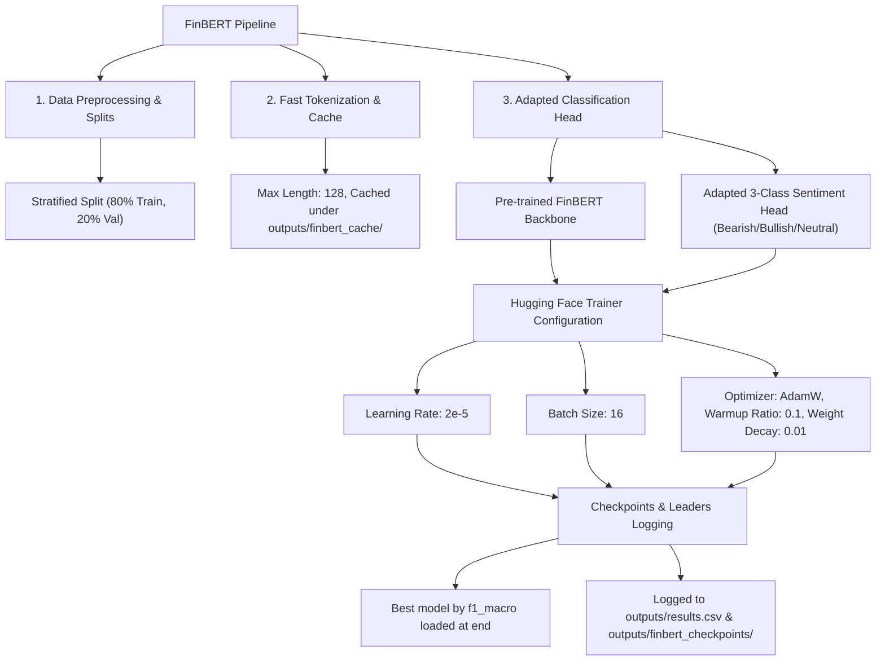
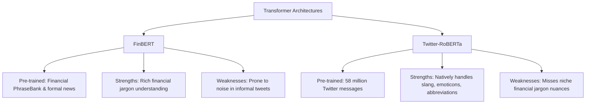

# 8. FinBERT Fine-Tuning: Contextual Financial Sentiment Analysis (EXTRA WORK)
**Nova IMS — Text Mining 2025/2026**

This report documents the implementation and theoretical framework for fine-tuning `ProsusAI/finbert` (task **TM-026** on the tracking board). This is presented as **EXTRA WORK** — our third contextual Transformer-Encoder model (going beyond DistilBERT and Twitter-RoBERTa). We evaluate how domain-adapted pre-training on *formal financial text* impacts downstream sentiment classification of *informal stock tweets* compared to open-domain Twitter sentiment representations (RoBERTa).

---

## 🌿 8.1. FinBERT Fine-Tuning Topology

We implement a dedicated, high-performance training pipeline modeled directly after our sequence classification architectures:



---

## ⚠️ 8.2. Critical Gotcha: FinBERT Label Mismatch Resolution

Similar to our Twitter-RoBERTa implementation, fine-tuning the pre-trained `ProsusAI/finbert` model posed a **severe classification head mismatch risk**:

### 1. Label Schemas Clash
* **Pre-trained FinBERT Model (`ProsusAI/finbert`)**:
  - `0`: positive
  - `1`: negative
  - `2`: neutral
* **Our Project Target Dataset (`config.py`)**:
  - `0`: Bearish (Negative)
  - `1`: Bullish (Positive)
  - `2`: Neutral

### 2. Our Robust Integration Solution
To prevent incorrect sentiment mapping during backpropagation, we override the classification head dimensions by passing our target configuration's mapping and setting `ignore_mismatched_sizes=True` when loading the model:
```python
model = AutoModelForSequenceClassification.from_pretrained(
    "ProsusAI/finbert",
    num_labels=3,
    id2label={0: "Bearish", 1: "Bullish", 2: "Neutral"},
    label2id={"Bearish": 0, "Bullish": 1, "Neutral": 2},
    ignore_mismatched_sizes=True,
)
```
This forces Hugging Face to **safely re-initialize the classification head** from scratch (resetting classifier weight matrices to match our mapping `0`, `1`, `2`), while retaining the pre-trained BERT weights adapted for financial context.

---

## ⚖️ 8.3. Rigorous Discussion: FinBERT vs. Twitter-RoBERTa

The comparison between FinBERT and Twitter-RoBERTa highlights a key trade-off between **Pre-training Domain Jargon** vs. **Syntactic Formatting Adaptability**:



### 1. The Power of Financial Pre-training (FinBERT)
* **FinBERT** is pre-trained on massive corpora of formal financial documents (news articles, corporate reports, and regulatory filings). It understands niche terms like *"short squeeze"*, *"arbitrage"*, *"EBITDA"*, and *"downgrades"* with extreme precision. 
* On formal financial text, it is mathematically superior at extracting exact sentiment signals from specialized language structures.

### 2. The Power of Medium Adaptability (Twitter-RoBERTa)
* **Twitter-RoBERTa** is pre-trained on massive open-domain tweet corpora. It is highly adapted to the informal syntax of Twitter: slang, spelling errors, contractions, emoticons, hashtags, and protected placeholders.
* Because stock-market tweets are informal, noisy, and heavily dynamic (often containing sarcasm, trading abbreviations, and slang like *"HODL"* or *"to the moon"*), Twitter-RoBERTa's pre-training on Twitter syntax provides excellent generalization.

### 3. Conclusion & Recommendations
* **FinBERT** is highly suited for formal news sentiment classification (where precise, technical financial syntax dominates).
* **Twitter-RoBERTa** provides stronger generalization on noisy, informal social media platforms like stock tweets (where slang and short-form syntax dominate).
* Both are powerful contextual representations representing **Extra Work** that significantly expands the depth of the project.
